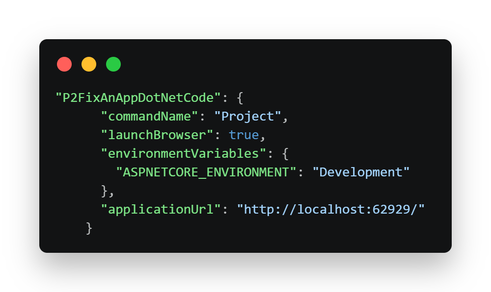

# DotNetprojet2

Application web e-commerce **Lambazon** développée en ASP.NET Core.

## Exécuter l'application en local

### Prérequis

- SDK .NET 9.0
- Éditeur de code / IDE compatible avec .NET :
  - Visual Studio (2022 recommandé)
  - Visual Studio Code (extension "C# Dev Kit" recommandée)
  - JetBrains Rider
- Optionnel : Git (intégré à Visual Studio)

### Instructions

#### Cloner le dépôt

```powershell
# cloner le projet dans le répertoire courant et s'y déplacer
git clone https://github.com/jdelobel5987/OC_DotNetprojet2.git
cd OC_DotNetprojet2
```

#### Exécuter l'application

##### En ligne de commande

```powershell
# depuis la racine du dépôt cloné
dotnet run --project P2FixAnAppDotNetCode\P2FixAnAppDotNetCode.csproj

# ou depuis le répertoire du projet
cd P2FixAnAppDotNetCode
dotnet run
```

##### Avec Visual Studio

1. Ouvrir la solution `P2FixAnAppDotNetCode.sln`
2. Définir `P2FixAnAppDotNetCode` comme projet de démarrage (clic droit sur le projet > "Définir comme projet de démarrage")
3. Démarrer l'application (F5 ou bouton "démarrer" ▶️ dans la barre d'outils)

#### Parcourir l'application

- Ouverture automatique dans un onglet navigateur web (si exécution par Visual Studio)
- Sinon: `Ctrl + clic` sur l'url indiquée dans le terminal (exemple: `http://localhost:62929`)

##### Fonctionnalités principales

- Ajout et suppression de produits dans le panier
- Formulaire de commande avec champs obligatoires
- Mise à jour du stock après une commande
- Système de localisation (français, anglais, espagnol)

#### Quitter l'application

`Ctrl + C` dans le terminal où l'application a été lancée ou bouton "arrêter" ⏹️ dans Visual Studio.

### Problèmes courants

- Port déjà utilisé
  - ❓l'application est déjà lancée
    - ✅ stopper l'instance en cours avant d'en relancer une nouvelle
  - ❓une autre application locale utilise le même port
    - ✅ stopper l'application en question
    - ✅ ou définir un nouveau port dans `P2FixAnAppDotNetCode\Properties\launchSettings.json` :

<p align="center">
    
</p>

- SDK .NET 9 absent:
  - ❓ Vérifier la version de .NET présente: `dotnet --version`
    - ✅ Installer le SDK .NET 9
      - Lien officiel Microsoft :
        [Télécharger le SDK .NET 9](https://dotnet.microsoft.com/en-us/download/dotnet/9.0)
      - Visual Studio Installer :
        - Cliquer sur "Modifier" pour l'installation Visual Studio
      - Visual Studio Code :  `Ctrl + Shift + P` : ".NET: Install New .NET SDK"
